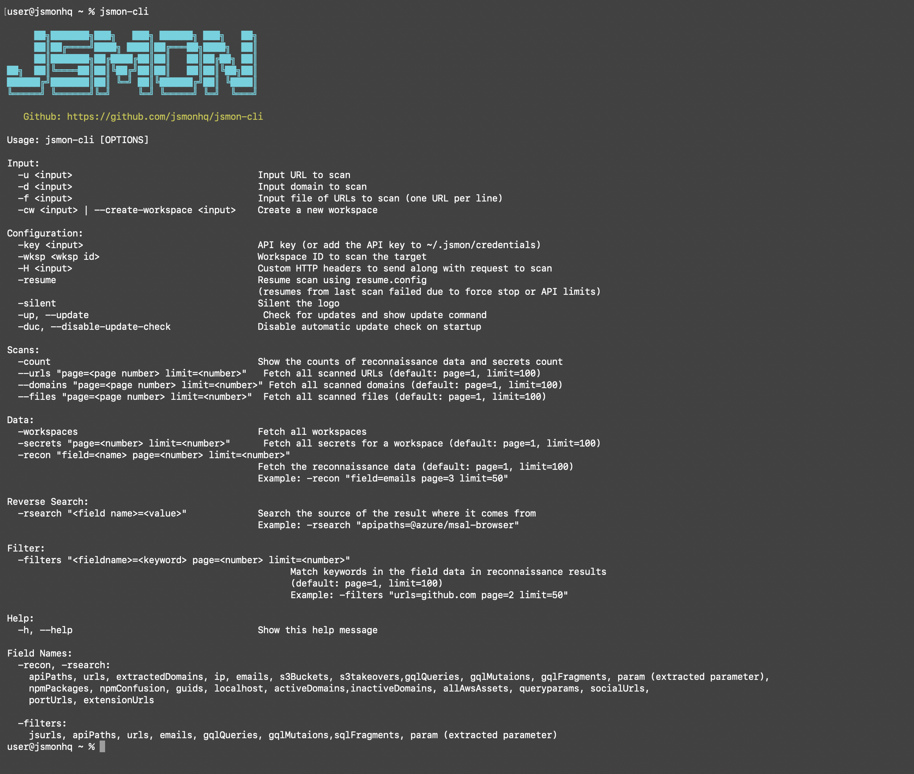
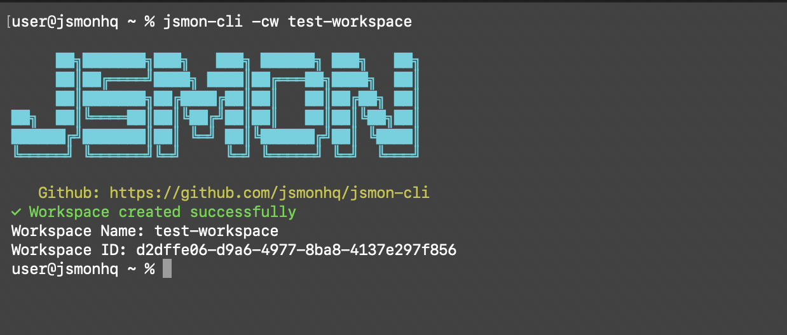
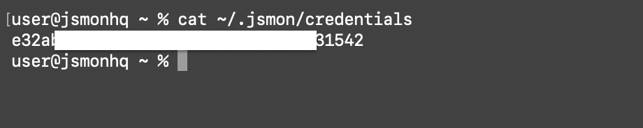
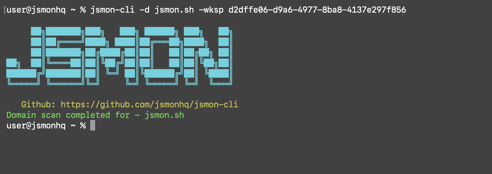

# JSMon CLI

The official command-line tool for [JSMon](https://jsmon.sh). Scan URLs and domains, upload files, and explore reconnaissance data—all from your terminal.



---

## Table of Contents

- [Quick Start](#quick-start)
- [Installation](#installation)
- [Configuration](#configuration)
- [Commands Overview](#commands-overview)
- [Scanning](#scanning)
- [Viewing Data](#viewing-data)
- [Reconnaissance & Filters](#reconnaissance--filters)
- [Reverse Search](#reverse-search)
- [Updates](#updates)
- [Examples](#examples)

---

## Quick Start

1. **Install** the CLI (see [Installation](#installation)).
2. **Set your API key** (flag, file, or env—see [Configuration](#configuration)).
3. **Create or pick a workspace**, then start scanning.

```bash
# Create a workspace
jsmon -cw "My Project" -key YOUR_API_KEY

# Scan a URL (use the workspace ID from the previous command)
jsmon -u "https://example.com/app.js" -wksp YOUR_WORKSPACE_ID

# List reconnaissance data (e.g. emails)
jsmon -recon "field=emails page=1" -wksp YOUR_WORKSPACE_ID
```



---

## Installation

### Option 1: Install from Go (recommended)

```bash
go install github.com/jsmonhq/jsmon-cli@latest
```

Ensure your Go `bin` directory is in your `PATH` (e.g. `$HOME/go/bin`). The binary is typically named `jsmon-cli`; you can rename or symlink it to `jsmon` if you prefer.

### Option 2: Build from source

```bash
git clone https://github.com/jsmonhq/jsmon-cli.git
cd jsmon-cli
go build -o jsmon .
```

Use `-o jsmon` to get a binary named `jsmon`.

---

## Configuration

### API key

Get your API key from [JSMon](https://jsmon.sh). The CLI looks for it in this order:

| Priority | Source |
|----------|--------|
| 1 | `-key YOUR_API_KEY` |
| 2 | File: `~/.jsmon/credentials` |
| 3 | Environment: `JSMON_API_KEY` |

**Credentials file:** Create `~/.jsmon/credentials` and put your API key on the first line (no label). Lines starting with `#` are ignored.

### Workspace ID

For scanning and data commands you need a **workspace ID**:

- Pass it with **`-wksp YOUR_WORKSPACE_ID`**, or
- Set **`JSMON_WORKSPACE_ID`** in your environment.

The workspace ID is **not** read from the credentials file; it must be provided per command or via env.

### Optional

- **`-H "Header-Name: value"`** — Add custom HTTP headers for scan requests (can be used multiple times).
- **`-silent`** — Hide the JSMon logo when running commands.



---

## Commands Overview

| What you want | Command / flag |
|---------------|-----------------|
| Create workspace | `-cw "Name"` or `--create-workspace "Name"` |
| Scan one URL | `-u "https://..."` |
| Scan a domain | `-d "example.com"` |
| Scan URLs from file | `-f urls.txt` |
| List workspaces | `-workspaces` |
| Scanned URLs | `--urls "page=1 limit=100"` |
| Scanned domains | `--domains "page=1 limit=100"` |
| Scanned files | `--files "page=1 limit=100"` |
| Secrets | `-secrets "page=1 limit=100"` |
| Reconnaissance data | `-recon "field=emails page=1"` |
| Filter recon by keyword | `-filters "urls=github page=1"` |
| Reverse search | `-rsearch "apipaths=@azure/msal-browser"` |
| Counts | `-count` |
| Resume scan | `-resume resume.cfg` |
| Check for updates | `-up` or `--update` |
| Disable startup update check | `-duc` or `--disable-update-check` |
| Help | `-h` or `--help` |

---

## Scanning

### Upload a single URL

```bash
jsmon -u "https://example.com/script.js" -wksp YOUR_WORKSPACE_ID
```

### Scan a domain

```bash
jsmon -d "example.com" -wksp YOUR_WORKSPACE_ID
```

### Upload multiple URLs from a file

Put one URL per line in a file, then:

```bash
jsmon -f urls.txt -wksp YOUR_WORKSPACE_ID
```

### Resume a previous scan

If a scan was interrupted (e.g. API limits), you can resume using the saved config:

```bash
jsmon -resume resume.cfg -wksp YOUR_WORKSPACE_ID
```



---

## Viewing Data

### Workspaces

```bash
jsmon -workspaces -key YOUR_API_KEY
```

### Scanned URLs, domains, and files

```bash
jsmon --urls "page=1 limit=50" -wksp YOUR_WORKSPACE_ID
jsmon --domains "page=1 limit=50" -wksp YOUR_WORKSPACE_ID
jsmon --files "page=1 limit=50" -wksp YOUR_WORKSPACE_ID
```

Default is `page=1` and `limit=100` if omitted.

### Secrets

```bash
jsmon -secrets "page=1 limit=100" -wksp YOUR_WORKSPACE_ID
```

### Count summary

```bash
jsmon -count -wksp YOUR_WORKSPACE_ID
```

Optional: add `-runId RUN_ID` for a specific run.

---

## Reconnaissance & Filters

### Fetch reconnaissance data (`-recon`)

Get extracted intelligence for a **field** and optional pagination:

```bash
jsmon -recon "field=emails page=1 limit=50" -wksp YOUR_WORKSPACE_ID
```

**Common fields:** `apiPaths`, `urls`, `extractedDomains`, `ip`, `emails`, `s3Buckets`, `gqlQueries`, `gqlFragments`, `param`, `queryparams`, `allAwsAssets`, `npmPackages`, `socialUrls`, `portUrls`, `extensionUrls`, and others (see `jsmon -h`).

### Filter by keyword (`-filters`)

Search within a field (e.g. only URLs containing "github"):

```bash
jsmon -filters "urls=github.com page=1" -wksp YOUR_WORKSPACE_ID
jsmon -filters "param=newegg page=1" -wksp YOUR_WORKSPACE_ID
```

Format: `"fieldname=keyword page=N limit=N"`. Defaults: `page=1`, `limit=100`.


---

## Reverse Search

Find where a value came from (e.g. which script exposes an API path):

```bash
jsmon -rsearch "apipaths=@azure/msal-browser" -wksp YOUR_WORKSPACE_ID
jsmon -rsearch "extractedDomains=blogs.jsmon.sh" -wksp YOUR_WORKSPACE_ID
```

Format: `"fieldname=value"`. Use **extractedDomains** (not `domains`) for domain reverse search.

---

## Updates

- **Automatic:** On startup the CLI checks for a newer release and prints a message if one exists (no auto-download).
- **Manual check:** `jsmon -up` or `jsmon --update` to check and see the install command.
- **Disable startup check:** `jsmon -duc` or `jsmon --disable-update-check`.

To upgrade after a new release:

```bash
go install github.com/jsmonhq/jsmon-cli@latest
```

---

## Examples

```bash
# Create workspace
jsmon -cw "My Project" -key YOUR_API_KEY

# Scan targets
jsmon -u "https://example.com/script.js" -wksp YOUR_WORKSPACE_ID
jsmon -d "example.com" -wksp YOUR_WORKSPACE_ID
jsmon -f urls.txt -wksp YOUR_WORKSPACE_ID

# Use credentials file (no -key needed)
jsmon -u "https://example.com/script.js" -wksp YOUR_WORKSPACE_ID

# Reconnaissance
jsmon -recon "field=emails page=1" -wksp YOUR_WORKSPACE_ID
jsmon -recon "field=allAwsAssets page=1" -wksp YOUR_WORKSPACE_ID

# Filter and reverse search
jsmon -filters "urls=api page=1" -wksp YOUR_WORKSPACE_ID
jsmon -rsearch "apipaths=/auth/login" -wksp YOUR_WORKSPACE_ID
```

---

## License & Links

- **GitHub:** [github.com/jsmonhq/jsmon-cli](https://github.com/jsmonhq/jsmon-cli)
- **JSMon:** [jsmon.sh](https://jsmon.sh)
